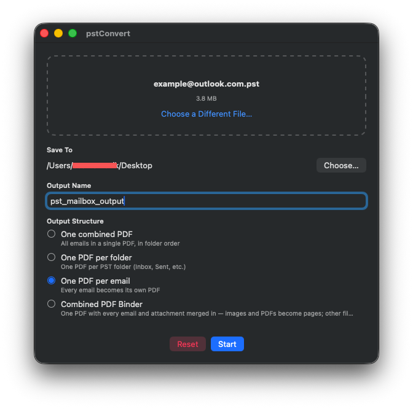

# pstConvert

A native macOS app (Apple Silicon) that converts Outlook `.pst` files into PDF — drag a file in, pick where the output goes, and it does the rest.



## Features

- **Drag and drop** — drop a `.pst` file onto the window, or click to browse
- **Choose your output** — pick a destination folder and name before converting
- **Four output structures**, selectable per conversion:
  - **One combined PDF** — every email in a single PDF, in folder order
  - **One PDF per folder** — one file per PST folder (Inbox, Sent, etc.)
  - **One PDF per email** — every email becomes its own PDF
  - **Combined PDF Binder** — one PDF with everything merged in: images and PDF attachments are inserted as real pages, other file types get a placeholder page and are saved alongside
- **Live progress** with a cancel button that stops cleanly and cleans up partial output
- Opens a Finder window at the result when done
- Fully native and self-contained — no Homebrew, Python, or other runtime dependencies required to run the built app

## Requirements

- macOS 13 (Ventura) or later
- Apple Silicon (arm64) Mac

## Installation

### Option A: Download the latest release

Grab the zip from the [Releases page](https://github.com/smsmev/pstConvert/releases/latest), unzip it, and drag `pstConvert.app` into `/Applications`.

The app is ad-hoc signed rather than notarized, so on first launch macOS will refuse to open it via a normal double-click. Right-click (or Control-click) `pstConvert.app` and choose **Open**, then confirm in the dialog that appears — you only need to do this once.

### Option B: Build from source

#### 1. Clone the repo

```bash
git clone https://github.com/smsmev/pstConvert.git
cd pstConvert
```

#### 2. Build the `readpst` dependency

pstConvert uses `readpst` (from the [libpst](https://github.com/pst-format/libpst) project) to read `.pst` files. It isn't committed to this repo — build it from official source with:

```bash
./scripts/build-readpst.sh
```

This downloads the libpst source tarball, strips its optional `libgsf` dependency (only needed for `.msg` export, which isn't used here), and compiles a self-contained `readpst` binary into `Resources/bin/readpst`. Requires the Xcode Command Line Tools (`xcode-select --install` if you don't already have them).

#### 3. Build and install the app

```bash
./build.sh    # builds the Swift package and assembles pstConvert.app in dist/
./install.sh  # copies it to /Applications
```

`build.sh` ad-hoc code-signs the app so it runs locally. Since it isn't notarized, the first launch may require right-clicking the app and choosing **Open**, or allowing it in **System Settings → Privacy & Security**.

## Usage

1. Open pstConvert and drag a `.pst` file onto the window (or click to browse).
2. Choose a destination folder and an output name.
3. Pick one of the four output structures.
4. Click **Start**. Progress and status are shown live; **Cancel** stops the conversion and removes partial output.
5. When it finishes, a Finder window opens at the result automatically.

## How it works

pstConvert bundles a compiled `readpst` binary to extract a `.pst` file's folders and messages into standard `.eml` files. A small MIME parser (headers, multipart bodies, quoted-printable/base64, RFC 2047 subjects) reads each `.eml`, and an off-screen `WKWebView` renders the message to PDF. Attachments are handled per the selected output mode — extracted alongside the PDFs, or merged directly into the binder as pages where possible.

## Third-Party Notices

pstConvert builds and bundles [**libpst / readpst**](https://github.com/pst-format/libpst) (version 0.6.76), licensed under the **GNU General Public License v2.0-or-later**. It is not included in this repository as source or binary — `scripts/build-readpst.sh` fetches the official upstream release tarball and compiles it locally. The only local modification is replacing `src/msg.cpp` with a stub that removes the optional `libgsf` dependency (used solely for `.msg` file export, which this app doesn't use); the rest of libpst is built unmodified. See `ThirdParty/libpst-COPYING.txt` for the full license text.

## License

pstConvert's own source code is licensed under the [MIT License](LICENSE). The bundled `readpst` binary is a separate program under the GPL-2.0-or-later — see [Third-Party Notices](#third-party-notices) above.
